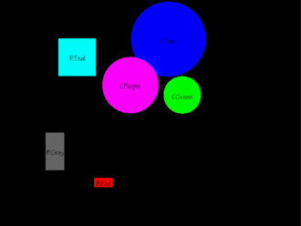
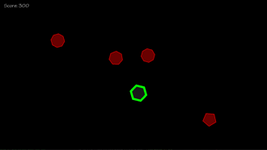

**This repository represents my path learning C++ and SFML**
  
## Verlet
Physics simulation using Verlet equation.

## COMP4300: Assignment_01
The task was to create a program that reads *config.txt* file with data on window size, font size, shapes to be drawn, etc, and make a window with shapes in different colors with window frame as a constraint for bouncing.

## COMP4300: Assignment_02
Simple 360 shooting game

